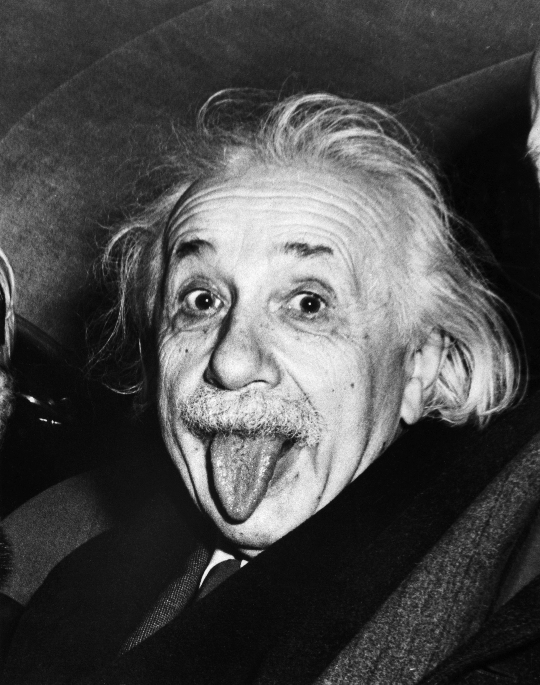
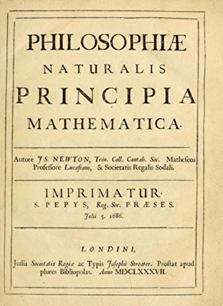
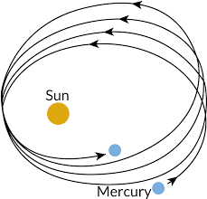

# 1 Introduction
There is a good chance that you already know what gravity is. It's that mysterious force that makes objects fall to the ground, right? Correct! You have probably also had a few unpleasant experiences with gravity in your life, perhaps that time you dropped your phone, or you fell off your bike. Gravity is one of the central forces of nature (to our knowledge) and it is the reason we can breathe on this earth. It is also the reason that planets exist, our oceans have tides and that an apple dropped on some guy's head in 17th century. Unlike some forces of nature, gravity is very obvious. We can directly observe its effects on our daily lives. The examples I mentioned above are just a few of the many consequences of gravity. Some of these consequences we can observe directly, like an apple falling to the ground, others are more obscure and barely detectable.

But what _is_ gravity? To be honest, we still don't quite know the exact answer to this question. However, throughout the years, a lot of extremely intelligent people have come up with a number of mathematical models that describe the inner workings of gravity. These mathematical models have gone through a number of permutations and are still being prefected to this day. In this artcicle we will explore these models and how they changed throughout time.

# 2 Isaac Newton

There once was a man named Isaac Newton. He was an English mathematician, physicist and astronomer who contributed very significantly to all of those fields. One day, Newton was sitting underneath a tree on the grounds of Trinity College (Cambridge University), where he was the Lucasian Professor of mathematics.

He was sitting under this tree when he had a great insight. He saw an apple, falling from the tree. This falling apple made him think and philosophise about why things fall when dropped. This led him to developing his laws of universal gravitation. About two decades later, in 1687, he published his _Philosophiæ Naturalis Principia Mathematica_ (Figure above). In this work, he laid the foundations for classical mechanics, including his laws of motion and theory of gravity.

## 2.1 Newton's Laws of Motion
Although they are not the subject of this article, it is interesting to see Newton's laws of motion, so I will list them here.

1. In an inertial frame of reference, an object either remains at rest or continues to move at a constant velocity, unless acted upon by a force.
2. In an inertial frame of reference, the vector sum of the forces $F$ on an object is equal to the mass $m$ of that object multiplied by the acceleration $a$ of the object: $F = ma$.
3. When one body exerts a force on a second body, the second body simultaneously exerts a force equal in magnitude and opposite in direction on the first body. In mathematical terms: $\sum \vec{F}\_{ij} = -\sum \vec{F}\_{ji}$.

## 2.2 Newton's Law of Universal Gravitation
Newton's law of universal gravitation states that _every particle attracts every other particle in the universe with a force which is directly proportional to the product of their masses and inversely proportional to the square of the distance between their centres._ He derived this law using only empirical observations and what he called inductive reasoning. To break it down, the law states that every massive object attracts every other massive object. The force of this attraction is proportional to the product of the two masses. It is also inversely proportional to the square of the distance between the to objects. This means that the force gets _very weak very quickly_ if the distance between the object is increased. Newton expressed this law mathematically using the following equation:

	\begin{equation}
		F = G \frac{m_1 m_2}{r^2}.
		\label{eq:newton's_gravity}
	\end{equation}

Where $F$ is the force between the two objects, $m_1$ and $m_2$ are the masses of the two objects, $r$ is the distance between them and $G$ is the Newton's gravitational constant equal to approximately $6.67408 \, m^3 \, kg^{-1} \, s^{-2}$. This equation is quite intuitive. That is, it is fairly easy to see that the force $F$ get smaller quite quickly when $r$ is increased, because there is an $r^2$ in the denominator. For more than 200 years, this equation served as the primary equation of gravity in theoretical and applied physics and, to this day, it is still being used and taught all over the world (even though it is wrong). I myself find this law beautiful because of its simplicity.

## 2.3 Problems with Newton's Law of Universal Gravitation
Although Newton's law of gravitation was incredibly successful and accurate in (most of) its predictions, there were some problems with it. In fact, Newton himself admitted that his theory was not complete and that he did not understand what it was that made massive objects attract. More specifically, his law required the force of gravity to be transmitted instantaneously, which he felt was unsatisfactory and inexplicable. He was deeply uncomfortable with the notion of "action at a distance" that his equations implied. In 1692, in a letter to Richard Bentley, he wrote: _That one body may act upon another at a distance through a vacuum without the mediation of anything else, by and through which their action and force may be conveyed from one another, is to me so great an absurdity that, I believe, no man who has in philosophic matters a competent faculty of thinking could ever fall into it._ He recognised that his law did not explain if there was a medium through which gravity operated, or anything of the sort. It simply made predictions that were sufficiently accurate at that time.
In addition to a lack of explanation provided by Newton's law of gravitation, it also seemed to be conflicting with observations. More specifically, it seemed to be conflicting with observations surrounding the orbits of planets, especially that of Mercury. Astronomers noticed that the orbit of Mercury 'shifted' slightly every year, which had not been predicted by Newton's formula (see figure below).

Finally, Newton's law also failed to explain why gravitational forces had an effect on light. This effect had been observed by astronomers, which caused a lot of confusion among physicists. Light is massless, and should therefore (according to Newton's law) not be effected by gravity. Clearly, there was something missing.

# 3 Albert Einstein
In the beginning of the 20th century, there was a young German physicist named Albert Einstein. Near the beginning of his career, Einstein thought that Newtonian mechanics was no longer enough to reconcile the laws of classical mechanics (mostly developed by Newton) with the laws of the electromagnetic field (mostly developed by a physicist named James Clerk Maxwell). This led him to develop his theory of relativity during his time at the Swiss Patent Office in Bern (1902–1909). He first developed his _special theory of relativity_, after which he extended his ideas to gravity and developed his _general theory of relativity_.

## 3.1 Special Theory of Relativity
Einstein's special theory of relativity is one of the most famous theories of all time and it gave rise to what is now considered to be the most famous equation in all of physics, the mass-energy equivalence:

	\begin{equation}
		E = mc^2.
		\label{eq:energy-mass}
	\end{equation}

Special relativity is a theory regarding the relationship between space and time. It implies a lot of extremely weird consequences that have been confirmed experimentally including length contraction, time dilation, relativistic mass, mass–energy equivalence, a universal speed limit and relativity of simultaneity. In 1905, Einstein published his article titled _On the Electrodynamics of Moving Bodies_ in the _Annalen der Physik_. This article contained his special theory of relativity, and was based upon two postulates:

1. The laws of physics are invariant[^1] in all inertial systems[^2].

2. The speed of light in a vacuum is the same for all observers, regardless of the motion of the light source.

One of the consequences of special relativity is time dilation. Basically, what this implies is that if you were standing next to a highway and your friend was moving with a constant speed in a car on that highway, his watch would tick slower than yours. Which means that one minute in his car would be about one minute for you standing next to the highway, standing still[^3]. This relationship between time and space in two different reference frames is governed by the Lorentz transformation:

\begin{equation}
\begin{pmatrix}
t^{\prime} \\
x^{\prime} \\
y^{\prime} \\
z^{\prime}
\end{pmatrix}
=
\begin{pmatrix}
\frac{1}{\sqrt{\mathstrut1-v^2}} & \frac{-v}{\sqrt{\mathstrut1-v^2}} & 0 & 0 \\
\frac{-v}{\sqrt{\mathstrut1-v^2}} & \frac{1}{\sqrt{\mathstrut1-v^2}} & 0 & 0 \\
0 & 0 & 1 & 0 \\
0 & 0 & 0 & 1
\end{pmatrix}
\begin{pmatrix}
t \\
x \\
y \\
z \\
\end{pmatrix}.
\label{eq:lorentz}
\end{equation}

Or:

\begin{equation}
\left(X^{\prime}\right)^{\mu} = L_{\,\,\nu}^{\mu} X^{\nu}.
\label{eq:lorentz-einstein-sum}
\end{equation}

where $\left(t, x, y, z\right)$ and $\left(t^{\prime}, x^{\prime}, y^{\prime}, z^{\prime}\right)$ are the coordinates of an event in two frames, where the primed frame is seen from the unprimed frame as moving with speed $v$ along the x-axis, the speed of light has been set to 1, and $\frac{1}{\sqrt{1-v^2}}$ is the Lorentz factor. Equation \ref{eq:lorentz-einstein-sum} is the same as equation \ref{eq:lorentz} using four-vector notation and the Einstein Sum Convention.

## 3.2 General Theory of Relativity
After Einstein had published his first paper on special relativity, he went on to develop his ideas further and create a new theory of gravity. In what he described as one of the happiest thoughts of his life, he envisioned a person standing in an elevator. He imagined the elevator being constantly accelerated through space and came to the conclusion that the person inside the elevator would not be able to tell if the force they felt was due to acceleration, or gravity. This led him to believe that in fact, gravity and acceleration were the same thing. This principle is now called the _equivalence principal_, and it was the foundation for Einstein's general theory of relativity.

In general relativity, the universe is treated as four-dimensional spacetime. What the theory tells us is that this so-called fabric of spacetime is not flat, it is curved. In fact, it is matter that causes this curvature (see figure above). It also tells us that the gravitational force on massive objects is due to this curvature.  In particular, the curvature of spacetime is directly related to the energy and momentum of whatever matter and radiation are present. The relation is specified by the Einstein field equations, a system of partial differential equations:

\begin{equation}
R_{\mu\nu} - \frac{1}{2} R g_{\mu\nu} + \Lambda g_{\mu\nu} = \frac{8 \pi G}{c^4} T_{\mu\nu}
\label{eq:EFE}
\end{equation}

where $R_{\mu\nu}$ is the Ricci curvature tensor, $R$ is the scalar curvature, $g_{\mu\nu}$ is the metric tensor, $\Lambda$ is the cosmological constant, $G$ is Newton's gravitational constant, $c$ is the speed of light in vacuum, and $T_{\mu\nu}$ is the stress–energy tensor[^4].

**To this day, General Relativity is the best and most accurate description of gravity.**

## 3.3 Consequences of General Relativity
General relativity brought alongside it a lot of interesting implications. Some predictions of general relativity differ significantly from those of classical physics, especially concerning the passage of time, the geometry of space, the motion of bodies in free fall, and the propagation of light. Examples of such differences include gravitational time dilation, the gravitational redshift of light, and the gravitational time delay. The predictions of general relativity in relation to classical physics have been confirmed in all observations and experiments to date. It was able to answer a lot of question that were left unanswered by Newton and it even correctly predicted the orbit of Mercury. However, unanswered questions remain, the most fundamental being how general relativity can be combined with the laws of quantum physics to produce a complete theory of quantum gravity.

# 4 Conclusion
Gravity is one of the most important forces in the universe and it has been bewildering us for hundreds of years. From Newton's laws of universal gravitation to Einstein's theory of general relativity. Who knows, maybe there will be a major breakthrough in theoretical physics in the future that will reconcile quantum mechanics and gravity into one beautiful theory of quantum gravity. But until then, Einstein will do.

# References

1. Albert Einstein et al. “On the electrodynamics of moving bodies”. In:An-nalen der Physik17.891 (1905), p. 50.

2. Isaac  Newton.Philosophiae  naturalis  principia  mathematica.  Vol.  1.  G.Brookman, 1833.

3. Edwin  F  Taylor  and  John  Archibald  Wheeler.  “Introduction  to  generalrelativity”. In: (1975).

---

[^1]: They do not change.
[^2]: Systems which do not accelerate.
[^3]: This comparison is obviously exaggerated.
[^4]: Don't worry, I don't fully understand equation \ref{eq:EFE} either.